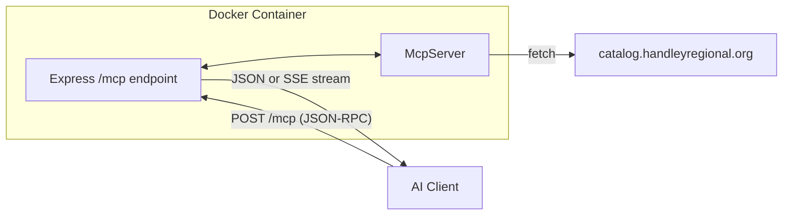

# Handley Library MCP Server

## Architecture



## Project Structure

```
mcp-handley-library/
├── src/
│   ├── index.ts          # Entry point, transport setup
│   ├── server.ts         # McpServer instance & tool registration
│   ├── tools/
│   │   ├── search.ts     # search_catalog tool
│   │   ├── availability.ts  # check_availability tool
│   │   └── details.ts    # get_book_details tool
│   └── lib/
│       └── api.ts        # HTTP client for library API
├── package.json
├── tsconfig.json
└── Dockerfile
```

## Dependencies

```json
{
  "dependencies": {
    "@modelcontextprotocol/sdk": "^1.25.3",
    "zod": "^3.25.0",
    "express": "^4.21.0"
  },
  "devDependencies": {
    "@types/node": "^22.0.0",
    "@types/express": "^4.17.21",
    "tsx": "^4.19.0",
    "typescript": "^5.7.0"
  }
}
```

Express is needed for Streamable HTTP transport.

## MCP Tools to Expose

Based on [api.md](api.md), implement three tools:

| Tool | Description | Key Inputs |

|------|-------------|------------|

| `search_catalog` | Search for books by title, author, subject, ISBN, etc. | query, field, limit |

| `check_availability` | Check real-time circulation status for items | Array of barcode + resourceId |

| `get_book_details` | Get full bibliographic info for a resource | resourceId |

## Transport Strategy

Per the [MCP Transports specification](https://modelcontextprotocol.io/specification/2025-11-25/basic/transports), there are two standard transports:

1. **stdio** - Client spawns server as subprocess, communicates via stdin/stdout
2. **Streamable HTTP** - Server exposes a single `/mcp` endpoint handling POST (requests) and GET (SSE streams)

Note: SSE as a standalone transport is **deprecated** as of protocol version 2024-11-05. Streamable HTTP incorporates SSE as an optional streaming mechanism within HTTP responses.

### Implementation Approach

1. **Phase 1 (Local):** Use `StdioServerTransport` for testing with Cursor/Claude Desktop
2. **Phase 2 (Remote):** Add Streamable HTTP with Express for Docker deployment

The Express server pattern from the official docs:

```typescript
import express from "express";

const app = express();
const server = new McpServer({ name: "library-catalog", version: "1.0.0" });

// Single MCP endpoint handles both POST and GET
app.post("/mcp", async (req, res) => {
  const response = await server.handleRequest(req.body);
  if (needsStreaming) {
    res.setHeader("Content-Type", "text/event-stream");
    // Send SSE events...
  } else {
    res.json(response);
  }
});

app.get("/mcp", (req, res) => {
  // Optional: server-initiated SSE streams
  res.setHeader("Content-Type", "text/event-stream");
});
```

### Security Considerations (for remote deployment)

- Validate `Origin` header to prevent DNS rebinding attacks
- For local dev, bind to `127.0.0.1` not `0.0.0.0`
- Session management via `Mcp-Session-Id` header (optional for stateful sessions)

## Docker Deployment

Use a multi-stage build with Node 22 Alpine base. Expose port 3000 for HTTP transport. No authentication initially.

```dockerfile
FROM node:22-alpine AS builder
WORKDIR /app
COPY package*.json ./
RUN npm ci
COPY . .
RUN npm run build

FROM node:22-alpine
WORKDIR /app
COPY --from=builder /app/dist ./dist
COPY --from=builder /app/node_modules ./node_modules
EXPOSE 3000
CMD ["node", "dist/index.js"]
```

## Key Implementation Notes

1. **Double-encoded JSON:** The library API requires `searchTerm` as a JSON string inside the JSON body - handle this in `lib/api.ts`
2. **Required headers:** All requests need `Ls2pac-config-name: ysm` and `Ls2pac-config-type: pac`
3. **Zod schemas:** Define input schemas for each tool; SDK v1.25.3 supports output schemas too if desired